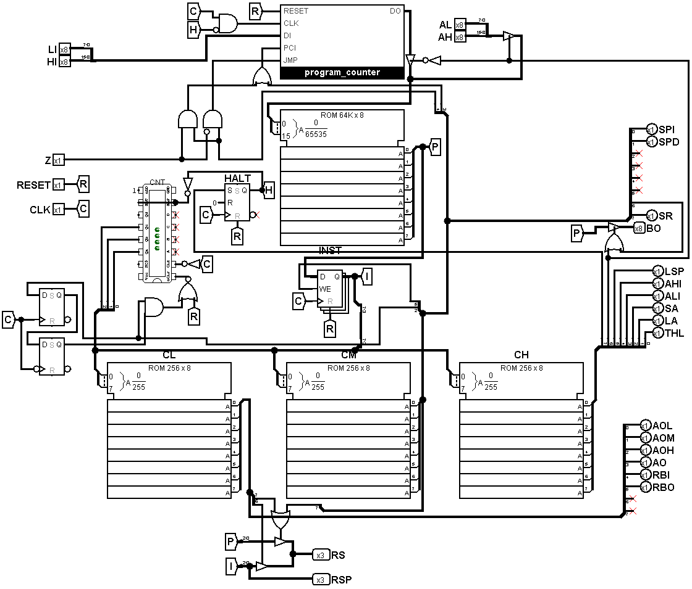

 ---
title: "Fateful"
author: "@kestrel"
description: "A fully custom 8-bit CPU with its own assembly language, emulator, and upcoming hardware implementation!"
created_at: "2025-05-27"
 ---

# Fateful Journal

This is the journal for the hardware version of [fateful](https://github.com/commonkestrel/fateful)!

## May 26, 2025

I worked on putting together a BOM for the control circuit!
While I already wired it up in Logisim Evolution forever ago,
a lot of these circuits don't quite map properly to real-world components. 

This is mostly so I know what components to use when making the actual circuit later down the line.
Something that turned out really nice is that the program counter can be entirely isolated on it's own circuit,
since it fully utilizes the components required.

There are a couple components that were a little more difficult to decide between, such as the 74HC173 vs 74HC377 vs 74HC573,
but I settled on the 173 and I'll just double up as these are 4-bit registers.
Lots of reading through datasheets for this update, sorry!

Each component has its issues,
for some reason there just isn't a commonly available 8-bit D Flip-Flop IC with output buffering, input control, and clock input.
Crazy, I know! Here's my thought process with these chips:

 * **74xx173**: Has everything I want including I/O enable, clock, etc., but it's only 4 bits, so I'll have to double up.
 * **74xx377**: Is 8-bit, but is missing a 3-state output, so I'd need a seperate octal transceiver to buffer the output from each one.
 * **74xx573/74xx574**: Is also 8-bit and output is buffered, but is either missing a clock input or input enable depending on the version which would require complex logic to not throw off the clock timing.

Overall, the 74HC173 requires two IC's instead of one,
but the reduced complexity is really appealing.

I also ended up needing a lot more inverters than I though,
since most logic inputs on registers and buffers and such are inverted.

Overall, the control circuit seems like it'll cost around $13.18, which is a relatively good price!
Keep in mind though that I already have the EEPROM's on hand,
so without those it would be quite a bit more expensive.

**Total time spent: 4h**
