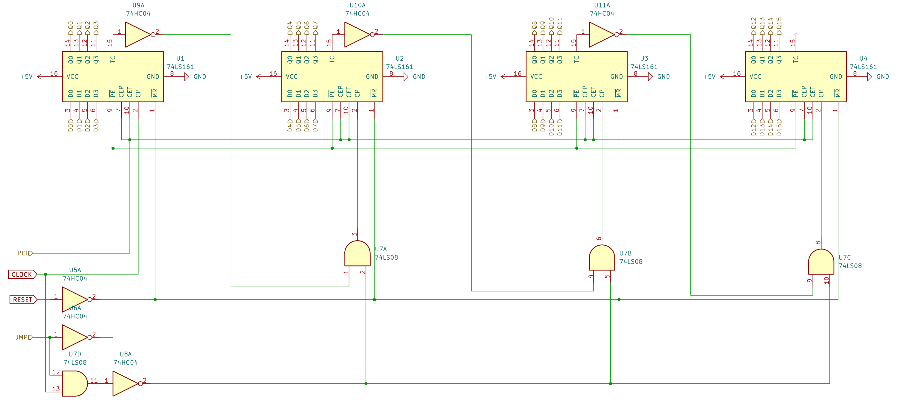
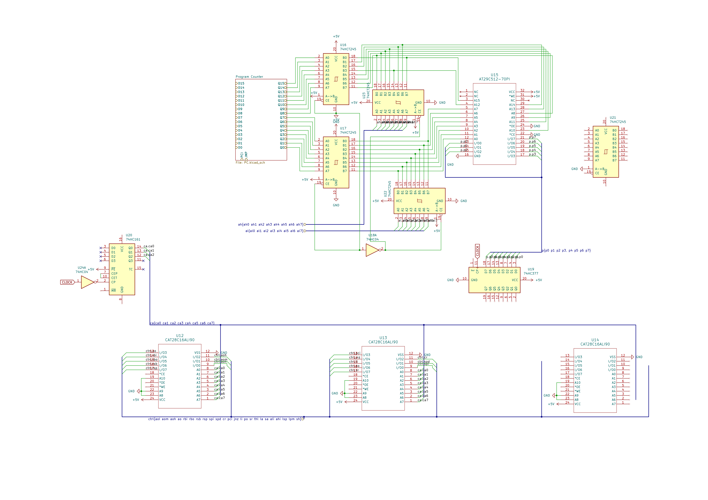

# Fateful Journal

This is the journal for the hardware version of [fateful](https://github.com/commonkestrel/fateful)!

## May 26, 2025

Today I worked on putting together a BOM for the control circuit!
While I already wired it up in Logisim Evolution forever ago,
a lot of these circuits don't quite map properly to real-world components. 

This is mostly so I know what components to use when making the actual circuit later down the line.
Something that turned out really nice is that the program counter can be entirely isolated on it's own circuit,
since it fully utilizes the components required.

There are a couple components that were a little more difficult to decide between, such as the 74HC173 vs 74HC377 vs 74HC573,
but I settled on the 173 and I'll just double up as these are 4-bit registers.
Lots of reading through datasheets for this update, sorry!

Each component has its issues,
for some reason there just isn't a commonly available 8-bit D Flip-Flop IC with output buffering, input control, and clock input.
Crazy, I know! Here's my thought process with these chips:

 * **74xx173**: Has everything I want including I/O enable, clock, etc., but it's only 4 bits, so I'll have to double up.
 * **74xx377**: Is 8-bit, but is missing a 3-state output, so I'd need a seperate octal transceiver to buffer the output from each one.
 * **74xx573/74xx574**: Is also 8-bit and output is buffered, but is either missing a clock input or input enable depending on the version which would require complex logic to not throw off the clock timing.

Overall, the 74HC173 requires two IC's instead of one,
but the reduced complexity is really appealing.

I also ended up needing a lot more inverters than I though,
since most logic inputs on registers and buffers and such are inverted.

Overall, the control circuit seems like it'll cost around $13.18, which is a relatively good price!
Keep in mind though that I already have the EEPROM's on hand,
so without those it would be quite a bit more expensive.

**Total time spent: 4h**

## May 27, 2025 

I did lots of work today on getting the control circuit actually implemented in a schematic! 
This involved a couple tweaks to the number of parts and which parts were used.
I realized that the W27C512 EEPROM, which I decided on yesterday,
required some weird voltages (14V, 12V, 2.5V) for programming,
which would make it very difficult to use.
Instead, I settled on the Atmel AT29C512 (I LOVE YOU ATMEL) for its focus on having purely 5V logic and control (and easier programming).

The first step to getting the control circuit implemented was to sketch the program counter:

The program counter is what determines what byte of the program the control circuit is pointing to.
This is incremented at the end of every instruction's execution in order to load the next instruction,
as well as during certain instructions to load registers and addresses.

After this was implemented, I started work on the actual control circuit.
This involved some research into KiCAD's heirarchical pins,
since this was my first time using the program :3

As you can tell by the many unconnected pins,
the control circuit is not quite finished.
Most of the progress today came from learning how busses work,
as well as linking the program counter and program Flash storage,
and finally adding the octal buffers to enable loading from the program memory.

For next steps, I'd love to implement the instruction counter,
since there was some weird clock pulse delay functionality that made it a bit of a pain to implement. After the control circuit is fully implemented, I'm tackling the register bank next!

**Total time spent: 8h**
